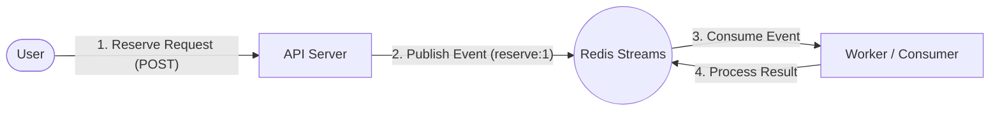

# Ticket Reservation API Server (티켓 예매 API 서버)

이 프로젝트는 **대규모 트래픽 상황에서의 데이터 정합성 유지와 동시성 제어**를 학습하기 위해 구축된 티켓 예매 서비스의 API 서버입니다.

Redis Streams를 활용한 비동기 처리를 구현하였습니다.

## 🚀 Key Features (주요 기능)

- **Redis Streams 기반 비동기 처리**: 대량의 예매 요청을 Redis Streams에 버퍼링하여 시스템 부하를 조절하고 유실 없는 처리를 보장합니다.

- **동시성 제어 학습**: 분산 환경에서의 락(Lock) 활용 및 데이터 일관성 유지를 위한 다양한 기법을 적용/실험합니다.

## 🛠 Tech Stack (기술 스택)

- **Language**: Java 21
- **Framework**: Spring Boot 3.x
- **Database / Message Broker**: Redis (Reactive & Classic Template)


## 🏗 Architecture (아키텍처)

이 서비스는 **Producer-Consumer 패턴**을 따르며, API 서버는 예매 요청을 받아 Redis Stream에 적재합니다.



> **Note**: 본 리포지토리는 **API Server**에 해당합니다. 실제 예매 로직을 수행하는 Worker 컴포넌트오의 연동을 전제로 합니다.

## 🏃 Getting Started (실행 방법)

### Prerequisites
- Java 21 이상
- Redis (기본 포트 6379, 로컬 실행 필요)

### Run
```bash
# Clone Repository
git clone <repository-url>

# Build
./gradlew build

# Run
./gradlew bootRun
```

## 📚 API Reference


### 1. 예매 요청 (Reserve Ticket)
티켓 예매를 요청합니다. 요청은 비동기로 처리됩니다.

- **URL**: `POST /api/ticket/reserve`
- **Body**:
```json
{
  "name": "홍길동",
  "phoneNumber": "010-1234-5678",
  "password": "password123",
  "seatId": "1" // 예매할 좌석 ID
}
```
